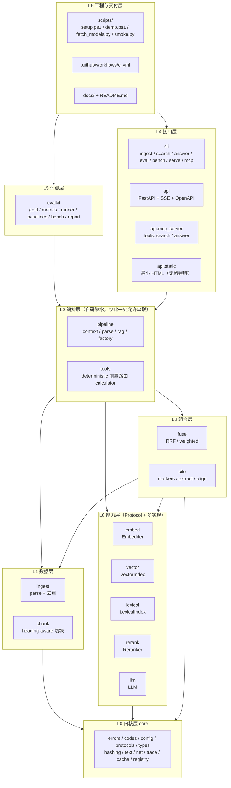
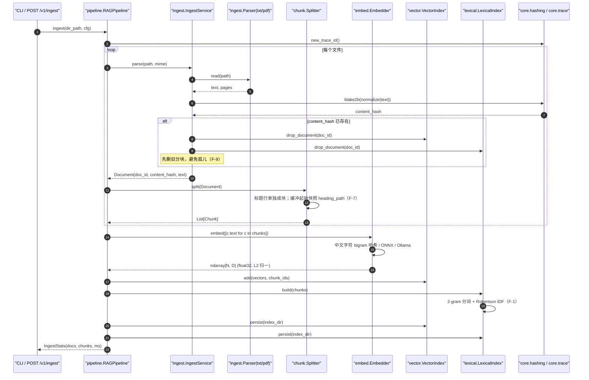
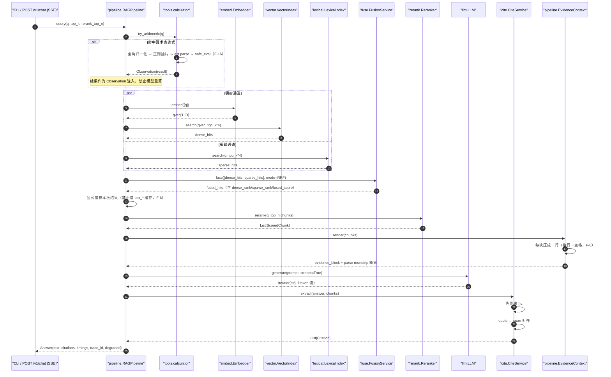
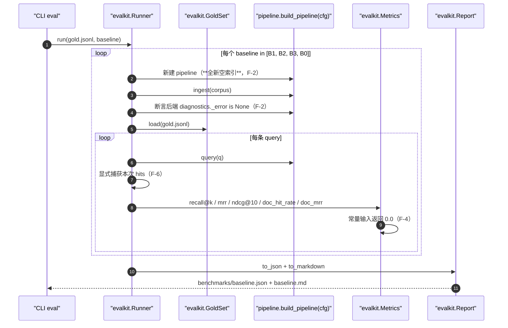
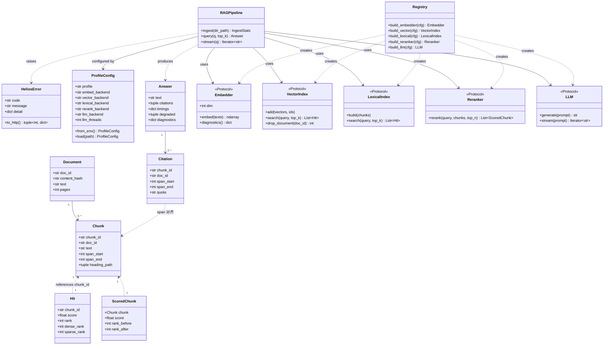

# ARCHITECTURE — helios-ai-stack

> 作者：晨星 ｜ 版本：v1.0 ｜ 状态：已定稿（基于 PRD v1.0 + 主理人对 Q1–Q6 的拍板）
> 上游输入：`docs/PRD.md`（产品经理 许清楚）
> 硬约束来源：本机实测（Windows 11 / 无 NVIDIA GPU / 16 核 / C 盘余 31G / Py3.13.14 / 无 MSVC+cmake / huggingface.co 不可达）

---

## 0. 全局约定（Engineer 必读，违反即返工）

| 编号 | 约定 | 落地方式 |
|---|---|---|
| C1 | 项目名 `helios-ai-stack`；**Python 包名 `helios`**；源码根 `src/helios/`；CLI 入口 `python -m helios.cli` + console script `helios` | `pyproject.toml` |
| C2 | 单文件 **≤ 300 行**；**入口文件只做装配，零业务逻辑** | ruff + `scripts/scan_emoji.py` 一并检查行数 |
| C3 | 源码内**绝不出现 emoji / 符号字面量**；检测类代码只用 `ord()` 码点范围 | `scripts/scan_emoji.py` 为 P0 门禁 |
| C4 | 模块间**只经 dataclass 与 Protocol 通信**，禁止 import 其它模块的实现细节（只可 import `core`） | ruff `flake8-tidy-imports`  banned-api + 单测 |
| C5 | 所有外部依赖 = 「Protocol + 可注入实现」；**默认实现必须是真实现，不是 stub** | `core/registry.py` |
| C6 | 全部异常继承 `HeliosError(code, message, detail)`；错误码 `E_<MODULE>_<REASON>` | `core/errors.py` |
| C7 | pytest 一律 `--basetemp=data/.pytest-tmp -p no:cacheprovider`；**判据以计数为准，不抓文本** | `pytest.ini` addopts |
| C8 | 任何指向 localhost 的 `httpx.Client` 必须 `trust_env=False` | `core/net.py` 唯一出口 |
| C9 | `.gitignore` 临时文件规则**根锚定 `/_*`**，并追加 `!/**/__init__.py` | `.gitignore` |
| C10 | 禁止 TODO / FIXME / 部分可用；`ruff check .` 必须 0 error | CI |

---

## 1. 一句话定位 + 系统分层

**一句话定位**：一个在无 GPU 的 Windows 机器上可离线一键复现、模块化可独立验证、检索质量与性能有量化基线的端到端 RAG 系统。

### 1.1 分层图



### 1.2 依赖方向（单向，禁止反向）

```
scripts / docs ──> cli / api ──> pipeline ──> fuse / cite ──> ingest / chunk
                                    │                              │
                                    └──> embed / vector / lexical / rerank / llm
                                                    │
                                                    └──> core（唯一公共底座）
```

`core` 不依赖任何上层；`evalkit` 只依赖 `core` + `pipeline` 的**公开返回值**，不读私有缓存字段（见 F-6）。

---

## 2. 模块划分表

| # | 模块 | 单一职责（一句话） | 输入 | 输出 | Protocol 名 | 错误码前缀 | 依赖的下层模块 | 独立验证方式 |
|---|---|---|---|---|---|---|---|---|
| M01 | `core` | 提供全局错误码、配置、数据契约、Protocol、文本/哈希/网络/追踪工具 | 无 | 类型与工具 | 定义方：`Embedder` `VectorIndex` `LexicalIndex` `Reranker` `LLM` | `E_CORE_*` | 无 | `src/helios/core/tests/*`（8 个用例文件）；`src/helios/core/examples/minimal.py` |
| M02 | `ingest` | 把 PDF/TXT/MD 解析成 Document 并按内容哈希去重 | `Path / bytes + mime` | `List[Document]` | `Parser`（内部） | `E_INGEST_*` | core | `src/helios/ingest/tests/*`（4 个）；`examples/minimal.py` |
| M03 | `chunk` | 标题感知切块 + overlap，输出带 span 的 Chunk | `Document` | `List[Chunk]` | 无（纯函数） | `E_CHUNK_*` | core | `src/helios/chunk/tests/*`（3 个）；`examples/minimal.py` |
| M04 | `embed` | 文本 → 稠密向量（float32 / L2 归一） | `List[str]` | `np.ndarray[N, D]` | `Embedder` | `E_EMBED_*` | core | `src/helios/embed/tests/*`（4 个）；`examples/minimal.py` |
| M05 | `vector` | 稠密索引的增删查与持久化 | `ndarray + ids` / `query vec` | `List[Hit]` | `VectorIndex` | `E_VECTOR_*` | core | `src/helios/vector/tests/*`（4 个）；`examples/minimal.py` |
| M06 | `lexical` | 稀疏/词法检索（BM25 + 中文 2-gram） | `query + corpus` | `List[Hit]` | `LexicalIndex` | `E_LEXICAL_*` | core | `src/helios/lexical/tests/*`（4 个）；`examples/minimal.py` |
| M07 | `fuse` | 多路结果融合（RRF / 加权）与去重 | `List[List[Hit]]` | `List[Hit]` | 无（纯函数） | `E_FUSE_*` | core | `src/helios/fuse/tests/*`（3 个）；`examples/minimal.py` |
| M08 | `rerank` | 对 top-N 候选交叉编码重排 | `query + List[Chunk]` | `List[ScoredChunk]` | `Reranker` | `E_RERANK_*` | core, embed（仅 ONNX 通道复用模型加载） | `src/helios/rerank/tests/*`（4 个）；`examples/minimal.py` |
| M09 | `llm` | 生成与流式生成（模板 / GGUF / Ollama / OpenAI 兼容） | `prompt + context` | `str` / `Iterator[str]` | `LLM` | `E_LLM_*` | core | `src/helios/llm/tests/*`（4 个）；`examples/minimal.py` |
| M10 | `tools` | 算术类查询的确定性前置计算（不经过模型） | `str expr` | `float` / `ToolError` | 无（纯函数） | `E_TOOLS_*` | core | `src/helios/tools/tests/test_calculator.py` |
| M11 | `cite` | 引用抽取、出处标记剥离、span 对齐校验 | `answer + context chunks` | `List[Citation]` | 无（纯函数） | `E_CITE_*` | core | `src/helios/cite/tests/*`（4 个）；`examples/minimal.py` |
| M12 | `pipeline` | **唯一**允许串联各模块的编排层；埋点与降级 | `PipelineConfig + query` | `Answer` | 无（消费者） | `E_PIPE_*` | core, ingest, chunk, embed, vector, lexical, fuse, rerank, llm, tools, cite | `src/helios/pipeline/tests/*`（4 个）；`examples/minimal.py` |
| M13 | `api` | HTTP/SSE + MCP 暴露，静态页托管 | HTTP 请求 | JSON / SSE | 无（适配层） | `E_API_*` | core, pipeline, ingest | `src/helios/api/tests/*`（6 个）；`examples/minimal.py` |
| M14 | `cli` | 子命令装配（零业务） | argv | 退出码 + stdout | 无 | 继承 `E_PIPE_*` `E_EVAL_*` | core, pipeline, evalkit, api | `src/helios/cli/tests/test_cli.py` |
| M15 | `evalkit` | 质量与性能评测、四组对照基线 | gold 集 + 配置 | `MetricsReport`（JSON/MD） | 无 | `E_EVAL_*` | core, pipeline | `src/helios/evalkit/tests/*`（5 个）；`examples/minimal.py` |
| M16 | `compat` | LlamaIndex 兼容 adapter（**可替换性证明**，P1） | 同 pipeline | 同 pipeline | 实现 `Embedder`/`VectorIndex`/`LLM` | `E_CORE_*` | core | `src/helios/compat/tests/test_llamaindex_adapter.py`（缺依赖则 skip） |

> 核心模块（P0-4 要求的 8+）：M02–M12 + M15 = **12 个业务模块**，全部满足「≥3 单测 + 独立 example」。

---

## 3. 模块调用关系时序图

### 3.1 主链路 A：ingest（摄入建库）



### 3.2 主链路 B：query（检索 + 重排 + 生成 + 引用）



### 3.3 主链路 C：eval（评测，独立索引）



---

## 4. 完整文件列表

> 约束：单文件 ≤ 300 行（下表「行」列为预估上限）。测试与示例为**模块自持**，可单独 `pytest`。

### 4.1 仓库根与工程配置

| 相对路径 | 职责（一句话） | 行 |
|---|---|---|
| `README.md` | 架构/部署/使用/基线表入口文档 | 280 |
| `LICENSE` | Apache-2.0 全文 | 200 |
| `CONTRIBUTING.md` | 贡献与工程纪律（门禁、署名「晨星」） | 110 |
| `pyproject.toml` | 包元数据、依赖声明、entry point、ruff/pytest 开关 | 90 |
| `requirements.txt` | 顶层钉版清单（宽松 pin，供人读） | 30 |
| `requirements.lock.txt` | 精确版本 + sha256，供 `--require-hashes` 安装 | 60 |
| `ruff.toml` | lint 规则集（含行数上限辅助检查） | 45 |
| `pytest.ini` | addopts 固定 `--basetemp=data/.pytest-tmp -p no:cacheprovider`、markers | 30 |
| `.gitignore` | 根锚定 `/_*` + `!/**/__init__.py`（F-19） | 45 |
| `.env.example` | 全部 `HELIOS_*` 环境变量样例 | 30 |
| `.github/workflows/ci.yml` | Windows × Py3.13 离线门禁 | 95 |
| `.github/workflows/release.yml` | tag 触发打包与产物上传 | 55 |
| `configs/default.yaml` | 公共默认参数（top_k / chunk_size / overlap 等） | 30 |
| `configs/profile_offline.yaml` | offline 档实现绑定 | 45 |
| `configs/profile_local.yaml` | local 档实现绑定（真实模型） | 55 |
| `configs/profile_remote.yaml` | remote 档实现绑定（P2） | 40 |

### 4.2 `src/helios/` 内核与业务

| 相对路径 | 职责（一句话） | 行 |
|---|---|---|
| `src/helios/__init__.py` | 包导出与 `__version__` | 10 |
| `src/helios/core/__init__.py` | 内核导出 | 8 |
| `src/helios/core/codes.py` | `E_<MODULE>_<REASON>` 全量常量 + HTTP 映射表 | 120 |
| `src/helios/core/errors.py` | `HeliosError` 及子类 + 详情结构 | 95 |
| `src/helios/core/config.py` | Profile 加载（YAML + env 覆盖）与校验 | 165 |
| `src/helios/core/protocols.py` | `Embedder`/`VectorIndex`/`LexicalIndex`/`Reranker`/`LLM` 五个 Protocol | 175 |
| `src/helios/core/types.py` | Document/Chunk/Hit/ScoredChunk/Citation/Answer/MetricsReport | 170 |
| `src/helios/core/hashing.py` | blake2b 内容哈希、mmh3 词哈希、稳定 ID | 70 |
| `src/helios/core/text.py` | 全角归一化、中英分词、句子切分正则（F-10） | 145 |
| `src/helios/core/net.py` | 网络闸门 + `trust_env=False` httpx 工厂（F-11） | 75 |
| `src/helios/core/trace.py` | trace_id、阶段耗时埋点、loguru 结构化日志 | 85 |
| `src/helios/core/cache.py` | diskcache 结果缓存（按 query+配置 hash） | 70 |
| `src/helios/core/registry.py` | profile → 实现的**唯一工厂**（换实现只改一行配置） | 100 |
| `src/helios/core/tests/test_errors.py` | 错误码与 HTTP 映射断言 | 95 |
| `src/helios/core/tests/test_codes.py` | 错误码唯一性/命名规范断言 | 70 |
| `src/helios/core/tests/test_config.py` | YAML + env 覆盖与非法值拒绝 | 110 |
| `src/helios/core/tests/test_types.py` | dataclass 冻结与序列化往返 | 80 |
| `src/helios/core/tests/test_text.py` | 分词/归一/句切（含 `Python 3.10` 用例，F-10） | 130 |
| `src/helios/core/tests/test_hashing.py` | 确定性哈希 | 65 |
| `src/helios/core/tests/test_net.py` | 闸门关闭时抛 `NET_DISABLED` | 60 |
| `src/helios/core/tests/test_cache.py` | 缓存命中与失效 | 70 |
| `src/helios/core/examples/minimal.py` | 内核最小可运行示例 | 55 |

| 相对路径 | 职责（一句话） | 行 |
|---|---|---|
| `src/helios/ingest/__init__.py` | 模块导出 | 8 |
| `src/helios/ingest/base.py` | `Parser` Protocol 与注册表 | 75 |
| `src/helios/ingest/text_parser.py` | txt/md 解析 | 85 |
| `src/helios/ingest/pdf_parser.py` | pypdf 解析（逐页 + 页码元信息） | 95 |
| `src/helios/ingest/service.py` | 目录遍历、mime 嗅探、内容哈希去重 | 120 |
| `src/helios/ingest/tests/test_text_parser.py` | txt/md 解析断言 | 75 |
| `src/helios/ingest/tests/test_pdf_parser.py` | PDF 解析断言（最小 PDF fixture 生成） | 75 |
| `src/helios/ingest/tests/test_service.py` | 批量摄入统计 | 115 |
| `src/helios/ingest/tests/test_dedupe.py` | 同内容二次摄入幂等 | 85 |
| `src/helios/ingest/examples/minimal.py` | 摄入最小示例 | 55 |

| 相对路径 | 职责（一句话） | 行 |
|---|---|---|
| `src/helios/chunk/__init__.py` | 模块导出 | 8 |
| `src/helios/chunk/splitter.py` | 标题感知切块（标题行单独成块 + 缓冲起始快照 heading path，F-7） | 165 |
| `src/helios/chunk/sizer.py` | 块长度估算（字符/词） | 65 |
| `src/helios/chunk/service.py` | 批量切块 + span 校验 | 85 |
| `src/helios/chunk/tests/test_splitter_heading.py` | 标题栈与继承断言 | 130 |
| `src/helios/chunk/tests/test_overlap.py` | overlap 边界断言 | 95 |
| `src/helios/chunk/tests/test_nonuniform.py` | **刻意非均匀**语料覆盖多分块路径（F-7） | 105 |
| `src/helios/chunk/examples/minimal.py` | 切块最小示例 | 55 |

| 相对路径 | 职责（一句话） | 行 |
|---|---|---|
| `src/helios/embed/__init__.py` | 模块导出 | 8 |
| `src/helios/embed/base.py` | `Embedder` 公共前处理（批量/L2/维度校验） | 70 |
| `src/helios/embed/hashing.py` | `HashingEmbedder`：mmh3 词哈希（中文 bigram）→ 定维 L2 归一（F-1） | 95 |
| `src/helios/embed/fastembed_backend.py` | fastembed（ONNX）通道，模型目录指向本地缓存 | 140 |
| `src/helios/embed/onnx_direct.py` | 裸 ORT 通道：运行时探测输入名 + truncation/padding 成对（F-14） | 155 |
| `src/helios/embed/ollama_backend.py` | Ollama `/api/embed`（bge-m3/nomic），localhost + `trust_env=False`（F-11） | 115 |
| `src/helios/embed/service.py` | 分批处理、维度断言、降级与 diagnostics | 95 |
| `src/helios/embed/tests/test_hashing.py` | 确定性与 L2 归一 | 95 |
| `src/helios/embed/tests/test_service.py` | 批量与空输入 | 85 |
| `src/helios/embed/tests/test_normalize.py` | 归一化与维度一致性 | 70 |
| `src/helios/embed/tests/test_ollama.py` | Ollama 通道（`@mark.requires_model`，未就绪则 skip） | 75 |
| `src/helios/embed/examples/minimal.py` | 嵌入最小示例 | 55 |

| 相对路径 | 职责（一句话） | 行 |
|---|---|---|
| `src/helios/vector/__init__.py` | 模块导出 | 8 |
| `src/helios/vector/base.py` | `VectorIndex` 公共契约与 id map | 70 |
| `src/helios/vector/numpy_index.py` | 精确余弦暴力检索（offline 默认，**真实现**） | 125 |
| `src/helios/vector/faiss_index.py` | `IndexFlatIP` / `IndexIVFFlat` 自动切换 + 持久化 | 160 |
| `src/helios/vector/service.py` | upsert / `drop_document` / search / persist 编排 | 90 |
| `src/helios/vector/tests/test_numpy.py` | 精确性与 top-k 序 | 105 |
| `src/helios/vector/tests/test_faiss.py` | faiss 与 numpy 结果一致性 | 115 |
| `src/helios/vector/tests/test_drop_document.py` | 短文档重复摄入后无孤儿（F-9） | 95 |
| `src/helios/vector/tests/test_persist.py` | 落盘与重载 | 85 |
| `src/helios/vector/examples/minimal.py` | 向量检索最小示例 | 55 |

| 相对路径 | 职责（一句话） | 行 |
|---|---|---|
| `src/helios/lexical/__init__.py` | 模块导出 | 8 |
| `src/helios/lexical/tokenize.py` | 中文字符 2-gram + 英文按词 | 95 |
| `src/helios/lexical/bm25.py` | rank_bm25 封装 + **Robertson IDF 兜底**（恒非负，F-1） | 145 |
| `src/helios/lexical/inverted.py` | 倒排索引加速 | 115 |
| `src/helios/lexical/service.py` | build/query/persist | 95 |
| `src/helios/lexical/tests/test_tokenize.py` | 中英切分断言 | 85 |
| `src/helios/lexical/tests/test_idf.py` | **IDF 恒非负**与小语料非零分（F-1） | 90 |
| `src/helios/lexical/tests/test_service.py` | 检索与 top-k | 105 |
| `src/helios/lexical/tests/test_persist.py` | 状态落盘 | 75 |
| `src/helios/lexical/examples/minimal.py` | 词法检索最小示例 | 55 |

| 相对路径 | 职责（一句话） | 行 |
|---|---|---|
| `src/helios/fuse/__init__.py` | 模块导出 | 8 |
| `src/helios/fuse/rrf.py` | RRF 融合 | 95 |
| `src/helios/fuse/weighted.py` | 加权归一化融合 | 75 |
| `src/helios/fuse/service.py` | 按 chunk_id 去重并保留 dense_rank/sparse_rank/fused_score | 85 |
| `src/helios/fuse/tests/test_rrf.py` | RRF 公式与序 | 95 |
| `src/helios/fuse/tests/test_weighted.py` | 权重边界 | 75 |
| `src/helios/fuse/tests/test_dedupe.py` | 跨路去重与分数合并 | 85 |
| `src/helios/fuse/examples/minimal.py` | 融合最小示例 | 50 |

| 相对路径 | 职责（一句话） | 行 |
|---|---|---|
| `src/helios/rerank/__init__.py` | 模块导出 | 8 |
| `src/helios/rerank/base.py` | `Reranker` 公共契约与序位稳定 | 65 |
| `src/helios/rerank/lexical.py` | IDF 加权词法重排（offline 真实现，F-1） | 105 |
| `src/helios/rerank/onnx.py` | ONNX 交叉编码；默认 `Xenova/ms-marco-MiniLM-L-6-v2`，可选 `bge-reranker-base` | 145 |
| `src/helios/rerank/noop.py` | 直通重排（对照基线用） | 50 |
| `src/helios/rerank/service.py` | top-n 截断与序位变化记录 | 85 |
| `src/helios/rerank/tests/test_lexical.py` | 打分与稳定性 | 95 |
| `src/helios/rerank/tests/test_noop.py` | 恒等序 | 65 |
| `src/helios/rerank/tests/test_onnx.py` | ONNX 通道（`@mark.requires_model`） | 75 |
| `src/helios/rerank/tests/test_order.py` | 序位变化可断言 | 85 |
| `src/helios/rerank/examples/minimal.py` | 重排最小示例 | 50 |

| 相对路径 | 职责（一句话） | 行 |
|---|---|---|
| `src/helios/llm/__init__.py` | 模块导出 | 8 |
| `src/helios/llm/base.py` | `LLM` 公共契约（timeout/stream 统一） | 75 |
| `src/helios/llm/template.py` | 确定性模板生成 + 句子切分正则（F-10） | 140 |
| `src/helios/llm/llama_cpp_backend.py` | GGUF 推理，**线程数可配**（默认 4），禁止重装依赖 | 150 |
| `src/helios/llm/ollama_backend.py` | Ollama 生成（P2） | 115 |
| `src/helios/llm/openai_backend.py` | OpenAI 兼容远端（P2） | 115 |
| `src/helios/llm/service.py` | prompt 装配、流式统一、超时 | 95 |
| `src/helios/llm/tests/test_template.py` | 确定性 golden 断言 | 100 |
| `src/helios/llm/tests/test_sentence_split.py` | `Python 3.10` 不被误切（F-10） | 85 |
| `src/helios/llm/tests/test_stream.py` | 流式 token 拼接一致性 | 75 |
| `src/helios/llm/tests/test_service.py` | 超时与空 prompt | 85 |
| `src/helios/llm/examples/minimal.py` | 生成最小示例 | 55 |

| 相对路径 | 职责（一句话） | 行 |
|---|---|---|
| `src/helios/tools/__init__.py` | 模块导出 | 8 |
| `src/helios/tools/calculator.py` | 全角归一化 → 正则抽片 → `ast.parse` → `safe_eval`（F-16） | 120 |
| `src/helios/tools/tests/test_calculator.py` | 除零/溢出/非法表达式归一为 ToolError | 115 |

| 相对路径 | 职责（一句话） | 行 |
|---|---|---|
| `src/helios/cite/__init__.py` | 模块导出 | 8 |
| `src/helios/cite/markers.py` | 剥离 `[id#n]` 与 `依据/来源/source:` 出处标记（F-5） | 85 |
| `src/helios/cite/extract.py` | 从答案解析引用标记 → chunk_id | 135 |
| `src/helios/cite/align.py` | quote → (span_start, span_end) 对齐 | 115 |
| `src/helios/cite/service.py` | 编排与覆盖率统计 | 90 |
| `src/helios/cite/tests/test_markers.py` | 标记剥离断言（F-5） | 85 |
| `src/helios/cite/tests/test_extract.py` | 引用解析 | 95 |
| `src/helios/cite/tests/test_align.py` | span 对齐准确性 | 105 |
| `src/helios/cite/tests/test_roundtrip.py` | 抽取→对齐往返 | 75 |
| `src/helios/cite/examples/minimal.py` | 引用最小示例 | 50 |

| 相对路径 | 职责（一句话） | 行 |
|---|---|---|
| `src/helios/pipeline/__init__.py` | 模块导出 | 8 |
| `src/helios/pipeline/context.py` | 证据块渲染（**每块压成一行**，F-8） | 120 |
| `src/helios/pipeline/parse.py` | 证据块解析（续行**追加**到上一条，F-8） | 95 |
| `src/helios/pipeline/rag.py` | ingest/query/stream 编排 + 阶段耗时 + 降级 | 185 |
| `src/helios/pipeline/factory.py` | 由 profile 配置装配 pipeline | 115 |
| `src/helios/pipeline/tests/test_render_roundtrip.py` | 渲染→解析往返断言（F-8） | 95 |
| `src/helios/pipeline/tests/test_query_offline.py` | offline 全链路 | 130 |
| `src/helios/pipeline/tests/test_timings.py` | 各阶段 ms 埋点存在 | 75 |
| `src/helios/pipeline/tests/test_factory.py` | 换 profile 不改业务代码 | 95 |
| `src/helios/pipeline/examples/minimal.py` | 端到端最小示例 | 65 |

| 相对路径 | 职责（一句话） | 行 |
|---|---|---|
| `src/helios/api/__init__.py` | 模块导出 | 8 |
| `src/helios/api/schemas.py` | pydantic 请求/响应契约 | 125 |
| `src/helios/api/deps.py` | app state、pipeline 单例、配置注入 | 85 |
| `src/helios/api/error_handler.py` | `HeliosError` → HTTP 映射 | 90 |
| `src/helios/api/routes_health.py` | `/healthz` | 55 |
| `src/helios/api/routes_search.py` | `/v1/search` | 90 |
| `src/helios/api/routes_chat.py` | `/v1/chat` SSE：token/citation/done/error | 135 |
| `src/helios/api/routes_ingest.py` | `/v1/ingest` | 90 |
| `src/helios/api/routes_metrics.py` | `/metrics` | 65 |
| `src/helios/api/app.py` | `create_app()`：**内部完成路由注册**再返回（F-17） | 95 |
| `src/helios/api/mcp_server.py` | MCP tools：`search` / `answer` | 140 |
| `src/helios/api/static/index.html` | 最小提问页（无构建链，P1-8） | 190 |
| `src/helios/api/tests/test_health.py` | 200 断言 | 65 |
| `src/helios/api/tests/test_search.py` | 搜索契约 | 95 |
| `src/helios/api/tests/test_chat_sse.py` | SSE 事件序列 | 110 |
| `src/helios/api/tests/test_ingest.py` | 摄入接口 | 95 |
| `src/helios/api/tests/test_errors.py` | 错误码 → HTTP 状态 | 85 |
| `src/helios/api/tests/test_mcp.py` | MCP 工具可调用 | 85 |
| `src/helios/api/examples/minimal.py` | 起服务最小示例 | 55 |

| 相对路径 | 职责（一句话） | 行 |
|---|---|---|
| `src/helios/evalkit/__init__.py` | 模块导出 | 8 |
| `src/helios/evalkit/gold.py` | gold 集加载与 schema 校验 | 95 |
| `src/helios/evalkit/metrics.py` | recall@k / mrr / ndcg@10 / doc_hit_rate / doc_mrr（常量输入返回 0.0，F-4） | 160 |
| `src/helios/evalkit/runner.py` | 每档**新建独立索引**（F-2）+ 断言 `_error is None` + 显式捕获结果（F-6） | 155 |
| `src/helios/evalkit/baselines.py` | B1/B2/B3/B0 四组对照配置 | 115 |
| `src/helios/evalkit/bench.py` | 延迟 p50/p95、索引构建、线程扫描 | 140 |
| `src/helios/evalkit/report.py` | JSON + Markdown 报告 | 115 |
| `src/helios/evalkit/tests/test_metrics.py` | 指标公式与常量输入（F-4） | 120 |
| `src/helios/evalkit/tests/test_doc_level.py` | 文档级指标口径（F-3） | 95 |
| `src/helios/evalkit/tests/test_fresh_index.py` | 评测不复用生产库（F-2） | 95 |
| `src/helios/evalkit/tests/test_report.py` | 报告落盘 | 80 |
| `src/helios/evalkit/tests/test_bench.py` | 延迟统计 | 75 |
| `src/helios/evalkit/examples/minimal.py` | 评测最小示例 | 55 |

| 相对路径 | 职责（一句话） | 行 |
|---|---|---|
| `src/helios/cli/__init__.py` | 模块导出 | 8 |
| `src/helios/cli/main.py` | 子命令装配（只装配，零业务） | 155 |
| `src/helios/cli/__main__.py` | `python -m helios.cli` 入口 | 10 |
| `src/helios/cli/tests/test_cli.py` | 各子命令退出码 | 100 |

| 相对路径 | 职责（一句话） | 行 |
|---|---|---|
| `src/helios/compat/__init__.py` | 模块导出 | 8 |
| `src/helios/compat/llamaindex_adapter.py` | 用 LlamaIndex 实现同五个 Protocol（**可替换性证明**，P1） | 150 |
| `src/helios/compat/tests/test_llamaindex_adapter.py` | 同 gold 集跑通（缺依赖则 skip） | 85 |
| `src/helios/compat/examples/minimal.py` | adapter 最小示例 | 60 |

### 4.3 脚本、数据与文档

| 相对路径 | 职责（一句话） | 行 |
|---|---|---|
| `scripts/setup.ps1` | 建 venv → 装锁定依赖 → `pip check` → 冒烟 import（**默认不下载模型**） | 165 |
| `scripts/demo.ps1` | offline E2E（必过）→ 模型就绪则追加 local E2E | 130 |
| `scripts/fetch_models.py` | 经 ModelScope 拉模型到 `models/`，记录 sha256；失败降级 | 155 |
| `scripts/smoke.py` | `/healthz`、search、chat、ingest 冒烟 | 130 |
| `scripts/scan_emoji.py` | **P0 门禁**：扫描 emoji/符号字面量 + 单文件行数 ≤300 | 95 |
| `scripts/gen_lock.py` | 由已装环境生成 `requirements.lock.txt`（版本 + sha256） | 115 |
| `scripts/bench_threads.py` | llama-cpp 线程数扫描（2/4/6/8/16）取最优 | 95 |
| `data/corpus/*.txt` | 内置语料 ≥ 12 篇，中英混合，长度非均匀（F-7） | 12 个文件 |
| `data/gold.jsonl` | ≥ 50 条 query-doc 对 | 60 |
| `data/gold_citation.jsonl` | 20 条引用溯源标注 | 25 |
| `data/.gitkeep` | 占位，保证干净克隆目录存在 | 1 |
| `benchmarks/baseline.json` | 基线数据（脚本产出后入库） | 60 |
| `benchmarks/baseline.md` | 基线 Markdown 表 | 45 |
| `docs/PRD.md` | 产品需求（已有） | — |
| `docs/ARCHITECTURE.md` | 本文 | — |
| `docs/TASKS.md` | 任务分解 | — |
| `docs/DEPENDENCIES.md` | 版本 + 许可证清单 | 120 |
| `docs/EVALUATION.md` | 评测口径与基线解读 | 130 |

**合计**：约 **210 个文件**，源码 + 测试约 **1.4 万行**，全部单文件 ≤ 300 行。

---

## 5. 统一错误码表

命名规范：`E_<MODULE>_<REASON>`。全部异常继承 `HeliosError(code, message, detail)`；HTTP 层由 `api/error_handler.py` 映射，响应体含 `error.code`。

| 错误码 | 触发条件 | HTTP | 可恢复 | 守护测试 |
|---|---|---|---|---|
| `E_CORE_BAD_INPUT` | 参数类型/范围非法 | 400 | 是 | `core/tests/test_errors.py` |
| `E_CORE_NOT_FOUND` | 资源不存在 | 404 | 是 | 同上 |
| `E_CORE_CONFIG_INVALID` | profile yaml 缺键或值非法 | 400 | 否（需修配置） | `core/tests/test_config.py` |
| `E_CORE_INTERNAL` | 未分类内核异常 | 500 | — | — |
| `E_INGEST_BAD_INPUT` | 路径不存在 / mime 不支持 | 400 | 是 | `ingest/tests/test_service.py` |
| `E_INGEST_PARSE_FAILED` | 解析器抛错（PDF 损坏等） | 422 | 是（跳过该文件） | `ingest/tests/test_pdf_parser.py` |
| `E_INGEST_EMPTY_CORPUS` | 目录无可用文档 | 422 | 是 | `ingest/tests/test_service.py` |
| `E_INGEST_NOT_FOUND` | 指定 doc_id 不存在 | 404 | 是 | 同上 |
| `E_INGEST_INTERNAL` | 摄入未分类异常 | 500 | — | — |
| `E_CHUNK_BAD_INPUT` | Document 为空或参数非法 | 400 | 是 | `chunk/tests/test_splitter_heading.py` |
| `E_CHUNK_EMPTY_TEXT` | 清洗后无有效文本 | 422 | 是 | 同上 |
| `E_CHUNK_SPAN_OUT_OF_RANGE` | span 越界（内部一致性） | 500 | 否 | `chunk/tests/test_overlap.py` |
| `E_CHUNK_INTERNAL` | 切块未分类异常 | 500 | — | — |
| `E_EMBED_BAD_INPUT` | 文本列表为空/含 None | 400 | 是 | `embed/tests/test_service.py` |
| `E_EMBED_DIM_MISMATCH` | 实际维度 ≠ 配置维度 | 500 | 否 | `embed/tests/test_normalize.py` |
| `E_EMBED_MODEL_MISSING` | 模型文件缺失且不允许下载 | 503 | 是（换后端/放模型） | `embed/tests/test_service.py` |
| `E_EMBED_NET_DISABLED` | `HELIOS_ALLOW_NETWORK=0` 时出网 | 403 | 是（开网或换后端） | `core/tests/test_net.py` |
| `E_EMBED_TIMEOUT` | 嵌入超时 | 504 | 是（重试/降批） | `embed/tests/test_ollama.py` |
| `E_EMBED_DEGRADED` | 严格模式下后端不可用（非严格仅告警） | 503 | 是 | `embed/tests/test_service.py` |
| `E_LEXICAL_BAD_INPUT` | query 为空 | 400 | 是 | `lexical/tests/test_service.py` |
| `E_LEXICAL_EMPTY_CORPUS` | 未 build 即查询 | 422 | 是 | 同上 |
| `E_LEXICAL_NOT_FOUND` | chunk_id 不在索引 | 404 | 是 | 同上 |
| `E_LEXICAL_INTERNAL` | 词法未分类异常 | 500 | — | — |
| `E_VECTOR_BAD_INPUT` | 向量形状非法 | 400 | 是 | `vector/tests/test_numpy.py` |
| `E_VECTOR_DIM_MISMATCH` | 查询维度 ≠ 索引维度 | 400 | 否 | 同上 |
| `E_VECTOR_NOT_FOUND` | id 不存在 | 404 | 是 | `vector/tests/test_drop_document.py` |
| `E_VECTOR_INDEX_CORRUPT` | 落盘文件损坏/校验失败 | 500 | 是（重建） | `vector/tests/test_persist.py` |
| `E_VECTOR_INTERNAL` | 向量未分类异常 | 500 | — | — |
| `E_FUSE_BAD_INPUT` | 输入非 Hit 列表 | 400 | 是 | `fuse/tests/test_rrf.py` |
| `E_FUSE_EMPTY_INPUT` | 所有通路均为空 | 422 | 是 | `fuse/tests/test_dedupe.py` |
| `E_FUSE_INTERNAL` | 融合未分类异常 | 500 | — | — |
| `E_RERANK_BAD_INPUT` | query 或候选为空 | 400 | 是 | `rerank/tests/test_lexical.py` |
| `E_RERANK_MODEL_MISSING` | 交叉编码模型缺失 | 503 | 是（降级 noop） | `rerank/tests/test_onnx.py` |
| `E_RERANK_NET_DISABLED` | 禁网时下载模型 | 403 | 是 | `core/tests/test_net.py` |
| `E_RERANK_TIMEOUT` | 重排超时 | 504 | 是 | `rerank/tests/test_onnx.py` |
| `E_RERANK_INTERNAL` | 重排未分类异常 | 500 | — | — |
| `E_LLM_BAD_INPUT` | prompt 为空 | 400 | 是 | `llm/tests/test_service.py` |
| `E_LLM_CONTEXT_OVERFLOW` | 上下文超窗口 | 400 | 是（截断证据） | 同上 |
| `E_LLM_MODEL_MISSING` | GGUF 缺失 | 503 | 是（换模板） | 同上 |
| `E_LLM_TIMEOUT` | 生成超时 | 504 | 是 | 同上 |
| `E_LLM_NET_DISABLED` | 禁网时调远端 | 403 | 是 | `core/tests/test_net.py` |
| `E_LLM_INTERNAL` | 生成未分类异常 | 500 | — | — |
| `E_TOOLS_BAD_EXPR` | 非算术表达式 | 422 | 是（走模型） | `tools/tests/test_calculator.py` |
| `E_TOOLS_UNSAFE_EXPR` | `ast.parse` 含非算术节点 | 422 | 是 | 同上 |
| `E_TOOLS_DIV_ZERO` | `ZeroDivisionError` 归一 | 422 | 是 | 同上 |
| `E_TOOLS_OVERFLOW` | `OverflowError` 归一 | 422 | 是 | 同上 |
| `E_CITE_PARSE_FAILED` | 答案引用标记无法解析 | 422 | 是 | `cite/tests/test_extract.py` |
| `E_CITE_NOT_FOUND` | chunk_id 不在上下文 | 404 | 是 | 同上 |
| `E_CITE_ALIGN_FAILED` | quote 无法在 chunk 中定位 | 422 | 是 | `cite/tests/test_align.py` |
| `E_CITE_INTERNAL` | 引用未分类异常 | 500 | — | — |
| `E_PIPE_BAD_INPUT` | query 为空 / 配置非法 | 400 | 是 | `pipeline/tests/test_query_offline.py` |
| `E_PIPE_NOT_FOUND` | 索引未构建 | 404 | 是 | 同上 |
| `E_PIPE_STAGE_FAILED` | 某阶段抛 HeliosError 且不可降级 | 500 | 是（修配置） | `pipeline/tests/test_factory.py` |
| `E_PIPE_TIMEOUT` | 全链路超时 | 504 | 是 | 同上 |
| `E_PIPE_INTERNAL` | 编排未分类异常 | 500 | — | — |
| `E_API_BAD_REQUEST` | 请求体校验失败 | 400 | 是 | `api/tests/test_errors.py` |
| `E_API_NOT_FOUND` | 路由不存在 | 404 | 是 | 同上 |
| `E_API_RATE_LIMITED` | 并发/频率保护 | 429 | 是 | `api/tests/test_search.py` |
| `E_API_STREAM_FAILED` | SSE 中断 | 500 | 是 | `api/tests/test_chat_sse.py` |
| `E_API_INTERNAL` | 接口未分类异常 | 500 | — | — |
| `E_EVAL_BAD_INPUT` | gold 集路径非法 | 400 | 是 | `evalkit/tests/test_report.py` |
| `E_EVAL_GOLD_INVALID` | gold 行 schema 不合法 | 422 | 否（修数据） | `evalkit/tests/test_metrics.py` |
| `E_EVAL_FIXTURE_STALE` | 评测索引非新建 / 后端 `_error` 非空 | 500 | 否（重跑） | `evalkit/tests/test_fresh_index.py` |
| `E_EVAL_INTERNAL` | 评测未分类异常 | 500 | — | — |

---

## 6. 三档 profile 对照表

切换方式：环境变量 `HELIOS_PROFILE`（`offline` | `local` | `remote`）或 CLI `--profile`；YAML 见 `configs/profile_*.yaml`。
**换嵌入实现只改一行**：`HELIOS_EMBED_BACKEND` 或 YAML 中 `embed.backend:` 一行 —— 业务代码零改动。

| 能力 | `offline`（**默认**，零下载零 Key） | `local`（真实模型档） | `remote`（P2） |
|---|---|---|---|
| 嵌入 `Embedder` | `HashingEmbedder`（mmh3 词哈希；中文字符 bigram；384 维 L2 归一） | ① 优先 `OllamaEmbedder`（本机已有 bge-m3 / nomic-embed-text）② `FastembedBackend`（ONNX，ModelScope 缓存）③ `OnnxDirect`（裸 ORT）④ 全失败 → 回落 `HashingEmbedder` 并 `degraded` | `OllamaEmbedder` / OpenAI 兼容 |
| 向量 `VectorIndex` | `NumpyVectorIndex`（精确余弦，真实现） | `FaissVectorIndex`（`IndexFlatIP`，量 > 5w 自动 `IndexIVFFlat`） | 同 local |
| 稀疏 `LexicalIndex` | `Bm25Index`（rank_bm25 + Robertson IDF 兜底 + 中文 2-gram + 倒排） | 同 offline（算法一致，仅语料不同） | 同 offline |
| 重排 `Reranker` | `LexicalReranker`（IDF 加权词法，**真实现**） | `OnnxReranker`，默认 `Xenova/ms-marco-MiniLM-L-6-v2`（≈0.08GB）；开关切 `BAAI/bge-reranker-base`（1.04GB） | 远端 rerank API |
| 生成 `LLM` | `TemplateLLM`（确定性模板 + 句子切分正则） | `LlamaCppLLM`（GGUF，`n_threads` 可配，默认 4，bench 扫描 2/4/6/8/16） | `OllamaLLM` / `OpenAICompatLLM` |
| 算术路由 | `tools.calculator`（确定性前置，常开） | 同 | 同 |
| 网络 | `HELIOS_ALLOW_NETWORK=0`，出网即抛 `E_*_NET_DISABLED` | 允许（仅 `fetch_models.py`） | 允许 |
| 单测/E2E | 全绿（CI 门禁） | 缺模型则 `@mark.requires_model` skip，不 fail | skip |

### 6.1 环境变量总表

| 变量名 | 默认 | 作用 |
|---|---|---|
| `HELIOS_PROFILE` | `offline` | 档位选择 |
| `HELIOS_CONFIG` | `configs/default.yaml` | 配置覆盖文件 |
| `HELIOS_ALLOW_NETWORK` | `0` | 网络闸门 |
| `HELIOS_EMBED_BACKEND` | `hashing` | `hashing` / `fastembed` / `onnx` / `ollama` |
| `HELIOS_EMBED_MODEL` | 空 | 模型名或路径 |
| `HELIOS_EMBED_DIM` | `384` | 向量维度（维度不符即 `E_EMBED_DIM_MISMATCH`） |
| `HELIOS_VECTOR_BACKEND` | `numpy` | `numpy` / `faiss` |
| `HELIOS_LEXICAL_BACKEND` | `bm25` | `bm25` / `inverted` |
| `HELIOS_RERANK_BACKEND` | `lexical` | `lexical` / `onnx` / `none` |
| `HELIOS_RERANK_MODEL` | `Xenova/ms-marco-MiniLM-L-6-v2` | 重排模型 |
| `HELIOS_LLM_BACKEND` | `template` | `template` / `llama_cpp` / `ollama` / `openai` |
| `HELIOS_LLM_MODEL` | 空 | GGUF 路径或模型名 |
| `HELIOS_LLM_THREADS` | `4` | CPU 线程数（bench 扫描后写入基线） |
| `HELIOS_LLM_CTX` | `4096` | 上下文窗口 |
| `HELIOS_MODEL_DIR` | `models/` | 本地模型缓存 |
| `HELIOS_DATA_DIR` | `data/` | 语料与 gold 集 |
| `HELIOS_INDEX_DIR` | `data/index` | 索引落盘位置 |
| `HELIOS_CACHE_DIR` | `data/cache` | diskcache 目录 |
| `HELIOS_OLLAMA_HOST` | `http://127.0.0.1:11434` | Ollama 地址（`trust_env=False`） |
| `HELIOS_LOG_LEVEL` | `INFO` | 日志级别 |
| `HELIOS_TIMEOUT_SEARCH_MS` | `2000` | 检索超时 |
| `HELIOS_TIMEOUT_LLM_MS` | `120000` | 生成超时 |

### 6.2 Ollama 服务生命周期（local 档）

`core/net.py` 提供 `ollama_session()` 上下文管理器：**同进程内 `subprocess.Popen` 拉起 → 轮询 `/api/tags` 就绪 → 跑业务 → `finally` 回收**（F-12；禁止 `Start-Process`，沙箱 job object 会杀子进程）。Ollama 不可用时按 `E_EMBED_MODEL_MISSING` 降级，不崩溃。

---

## 7. 依赖包列表与构建配置

### 7.1 顶层钉版清单（全部为**本机已装且 import 通过**，零编译）

| 包 | 版本 | 许可证 | 用途 | 免编译可安装性 |
|---|---|---|---|---|
| `faiss-cpu` | 1.15.0 | MIT | 稠密 ANN 索引 | 已装 cp313 win_amd64 wheel |
| `fastembed` | 0.8.0 | Apache-2.0 | ONNX 嵌入/重排 | 纯 Python + ORT，已装 |
| `onnxruntime` | 1.30.0 | MIT | ONNX 推理 | 已装 wheel |
| `llama-cpp-python` | 0.3.19 | MIT | GGUF 本地生成 | 已装，**禁止重装** |
| `rank-bm25` | 0.2.2 | Apache-2.0 | BM25 | 纯 Python，已装 |
| `pypdf` | 6.18.1 | BSD-3-Clause | PDF 解析 | 纯 Python，已装 |
| `fastapi` | 0.141.1 | MIT | HTTP/SSE | 纯 Python，已装 |
| `uvicorn` | 0.53.0 | BSD-3-Clause | ASGI server | 纯 Python，已装 |
| `starlette` | 1.6.0 | BSD-3-Clause | ASGI 底座（传递依赖） | 已装 |
| `mcp` | 2.2.0 | MIT | MCP server | 已装 |
| `tokenizers` | 0.23.2 | Apache-2.0 | ONNX 前后处理 | 已装 wheel |
| `numpy` | 2.5.3 | BSD-3-Clause | 向量计算 | 已装 |
| `pydantic` | 2.13.5 | MIT | 数据契约 | 已装 |
| `httpx` | 0.28.1 | BSD-3-Clause | HTTP 客户端（统一 `trust_env=False`） | 已装 |
| `loguru` | 0.7.3 | MIT | 结构化日志 | 已装 |
| `diskcache` | 5.6.3 | MIT | 结果缓存 | 已装 |
| `mmh3` | 5.3.0 | MIT | 哈希嵌入/稳定 ID | 已装 |
| `PyYAML` | 6.0.3 | MIT | 配置 | 已装 |
| `pytest` | 8.4.2 | MIT | 测试（dev） | 已装 |
| `ruff` | 0.16.8 | MIT | lint（dev） | 已装 |

**可选 extras（不进 P0 验收链）**

| 包 | 版本 | 许可证 | 用途 | extra |
|---|---|---|---|---|
| `modelscope` | 最新纯 Python 版 | Apache-2.0 | 模型下载通道 | `[fetch]` |
| `llama-index-core` | 最新 | MIT | `compat` 可替换性证明（P1） | `[compat]` |
| `pytest-cov` | 最新 | MIT | 覆盖率 | `[dev]` |

> **无 GPL / AGPL / LGPL 传染性依赖**（门禁：`scripts/gen_lock.py` 生成清单后由 `docs/DEPENDENCIES.md` 逐项复核）。
> **出局项及理由**：`hnswlib`（PyPI 无 wheel，需 MSVC 编译）、`torch`/`sentence-transformers`（体积 >200MB，C 盘仅 31G）、`tantivy`（无 cp313 wheel）、`qdrant-client`（local 模式纯 Python，性能劣于 faiss-C++）、`Whoosh`（长期低维护）。

### 7.2 构建配置方案

| 文件 | 责任 | 关键内容 |
|---|---|---|
| `pyproject.toml` | 唯一权威声明 | `[project] name="helios-ai-stack"`, `packages=["helios"]` under `src/`, `requires-python=">=3.13,<3.14"`, `[project.scripts] helios="helios.cli.main:main"`, optional-deps `fetch`/`compat`/`dev` |
| `requirements.txt` | 人读顶层钉版 | `faiss-cpu==1.15.0` 等 20 行，含注释说明「本机已装，禁止重装」 |
| `requirements.lock.txt` | 机器安装 | 精确版本 + `--hash=sha256:...`，由 `scripts/gen_lock.py` 生成，供 `pip install -r requirements.lock.txt --require-hashes` |
| `ruff.toml` | lint | `line-length=110`；`select=["E","F","I","UP","B","SIM","TID"]`；`ignore` 收紧；每文件 `E501` 之外另由 `scan_emoji.py` 管行数 |
| `pytest.ini` | 测试 | `addopts = -q --basetemp=data/.pytest-tmp -p no:cacheprovider`；`markers = requires_model, slow, compat`；`testpaths = src` |
| `.github/workflows/ci.yml` | CI | `windows-latest × 3.13` → 装锁定依赖 → `pip check` → `ruff check .` → `python scripts/scan_emoji.py` → `pytest -m "not requires_model"` → `python -m helios.cli demo --profile offline` |

> **CI 判据以计数为准**（F-13）：不解析 pytest 文本输出，改用 `--junitxml` 或退出码 + `scripts/smoke.py` 计数断言。

---

## 8. 数据契约

### 8.1 核心 dataclass

```python
@dataclass(frozen=True)
class Document:
    doc_id: str            # blake2b(normalize(text))[:16]
    source: str            # 原始相对路径
    mime: str              # text/plain | text/markdown | application/pdf
    content_hash: str      # blake2b-128 of normalized bytes（幂等去重依据）
    text: str
    pages: int
    meta: dict[str, str]   # {"title": ..., "lang": "zh|en"}
    created_at: str        # ISO 8601 UTC

@dataclass(frozen=True)
class Chunk:
    chunk_id: str          # f"{doc_id}#{ordinal:04d}"
    doc_id: str
    ordinal: int
    text: str
    span_start: int        # 相对 Document.text 的字符区间 [start, end)
    span_end: int
    heading_path: tuple[str, ...]   # 缓冲起始时快照（F-7）
    token_estimate: int

@dataclass(frozen=True)
class Hit:
    chunk_id: str
    score: float
    source: str            # "dense" | "sparse" | "fused"
    rank: int              # 1-based，本通路内位次
    dense_rank: int | None
    sparse_rank: int | None
    fused_score: float | None

@dataclass(frozen=True)
class ScoredChunk:
    chunk: Chunk
    score: float
    stage: str             # "fused" | "reranked"
    rank_before: int
    rank_after: int

@dataclass(frozen=True)
class Citation:
    citation_id: str
    chunk_id: str
    doc_id: str
    span_start: int
    span_end: int
    quote: str
    score: float

@dataclass(frozen=True)
class Answer:
    query: str
    text: str
    citations: tuple[Citation, ...]
    timings: dict[str, float]        # ms：embed/search/fuse/rerank/generate/cite/total
    trace_id: str
    profile: str
    degraded: tuple[str, ...]        # 降级组件名；空 = 未降级
    diagnostics: dict[str, object]   # 后端自检，含 "_error": None 断言位（F-2）

@dataclass(frozen=True)
class MetricsReport:
    profile: str
    baseline: str                    # B0/B1/B2/B3
    query_count: int
    recall_at_5: float
    recall_at_10: float
    mrr: float
    ndcg_at_10: float
    doc_hit_rate: float              # 头条指标（F-3）
    doc_mrr: float
    latency_p50_ms: float
    latency_p95_ms: float
    created_at: str                  # ISO 8601 UTC
```

### 8.2 Protocol 定义（`core/protocols.py`）

```python
class Embedder(Protocol):
    dim: int
    def embed(self, texts: list[str]) -> np.ndarray: ...        # [N, D] float32, L2 归一
    def diagnostics(self) -> dict[str, object]: ...             # 含 "_error": str|None

class VectorIndex(Protocol):
    def add(self, vectors: np.ndarray, ids: list[str]) -> None: ...
    def search(self, query: np.ndarray, top_k: int) -> list[Hit]: ...
    def drop_document(self, doc_id: str) -> int: ...             # 返回删除条数（F-9）
    def persist(self, path: str) -> None: ...
    @classmethod
    def load(cls, path: str) -> "VectorIndex": ...

class LexicalIndex(Protocol):
    def build(self, chunks: list[Chunk]) -> None: ...
    def search(self, query: str, top_k: int) -> list[Hit]: ...
    def drop_document(self, doc_id: str) -> int: ...
    def persist(self, path: str) -> None: ...

class Reranker(Protocol):
    def rerank(self, query: str, chunks: list[Chunk], top_n: int) -> list[ScoredChunk]: ...

class LLM(Protocol):
    def generate(self, prompt: str) -> str: ...
    def stream(self, prompt: str) -> Iterator[str]: ...
```

### 8.3 类关系图



---

## 9. 性能基线与对标方案

### 9.1 指标与测量方式

| 指标 | 定义 | 测量方式 | 门限（P0） |
|---|---|---|---|
| `doc_hit_rate` | **头条指标**：top-k 中命中 golden doc_id 的 query 占比 | `evalkit/metrics.py`，文档级（F-3） | ≥ 0.95 |
| `doc_mrr` | 文档级 MRR | 同上 | ≥ 0.80 |
| `recall@5` / `recall@10` | 块级召回（**仅诊断项**，会被过宽真值低估，F-3） | 同上 | `recall@10` ≥ 0.90 |
| `mrr` | 块级 MRR | 同上 | 记录，不设门限 |
| `ndcg@10` | 重排前后对比的核心指标 | 同上 | 重排后相对 B0 **提升 ≥ 10%** |
| `citation_hit_rate` | 引用可回溯比例（20 条标注） | `cite` + `gold_citation.jsonl` | = 1.00 |
| `latency_p50` / `p95`（检索） | 单次 hybrid 检索耗时 | `bench.py`，50 query × 5 轮，预热 3 轮 | p50 ≤ 30ms / p95 ≤ 120ms |
| `latency_p50`（E2E） | 检索+重排+生成 | 同上 | local ≤ 15s；**offline ≤ 1s** |
| `index_build_s` | 10k chunk × 384 维建库耗时 | `bench.py` | ≤ 60s |
| `llm_threads_opt` | llama-cpp 线程扫描最优值 | `scripts/bench_threads.py`（2/4/6/8/16） | 默认 4，实测覆盖则更新 |

### 9.2 三组内部对照基线（+ 1 组重排增益对照）

| 组 | 名称 | 配置 | 用途 |
|---|---|---|---|
| **B1** | 纯 BM25 | `lexical` 单路 → top-k，无 fuse，无 rerank | 关键词基线 |
| **B2** | 纯稠密 | `embed` → `vector` 单路 → top-k，无 rerank | 语义基线 |
| **B3** | 混合 + 重排（**系统默认**） | `dense + sparse` → RRF fuse → ONNX rerank → top-k | 完整方案 |
| **B0** | 混合 **无**重排 | 同 B3 但 `rerank=none` | **重排增益对照**：`ndcg@10(B3) / ndcg@10(B0) - 1 ≥ 10%` |

> 公开数据集（BEIR 子集）为 **P2**（P2-6），不进 P0 验收链。

### 9.3 评测纪律（硬性）

| 编号 | 纪律 | 守护测试 |
|---|---|---|
| N1 | 每档评测**新建独立索引**并重新灌语料，绝不复用生产库（F-2） | `evalkit/tests/test_fresh_index.py` |
| N2 | 断言真实后端 `diagnostics["_error"] is None`，否则抛 `E_EVAL_FIXTURE_STALE`（防止静默回退内存的「假成功」） | 同上 |
| N3 | 文档级指标为头条，块级仅诊断，口径写入 `docs/EVALUATION.md`（F-3） | `evalkit/tests/test_doc_level.py` |
| N4 | 秩相关函数在任一输入为常量时返回 `0.0`（F-4） | `evalkit/tests/test_metrics.py` |
| N5 | 接地/核验指标先剥离 `[id#n]` 与 `依据/来源/source:` 再算（F-5） | `cite/tests/test_markers.py` |
| N6 | 评估适配器**禁止**读 `last_*` 缓存字段，必须显式捕获本次结果（F-6） | `evalkit/tests/test_fresh_index.py` |
| N7 | 判据以**计数**为准，不抓文本、不靠人眼（F-13） | `scripts/smoke.py` |

---

## 10. 失败模式表（症状 / 根因 / 修法 / 守护测试）

| # | 症状 | 根因 | 修法 | 守护测试 |
|---|---|---|---|---|
| F-1 | BM25 在 2–3 篇小语料上得分**全 0** | rank_bm25 的 IDF 在词出现于半数文档时 = `ln(1) = 0` | 词法层用 Robertson IDF `ln(1+(N-n+0.5)/(n+0.5))`（恒非负）；重排用 IDF 加权词法兜底 | `lexical/tests/test_idf.py` |
| F-2 | 评测指标**静默全错且零异常** | 复用了生产索引 / 旧分块残留 | 每次 eval 新建独立索引重新灌语料 | `evalkit/tests/test_fresh_index.py` |
| F-2b | 弃用参数导致**静默回退内存**，断言依然全绿的「假成功」 | 后端吞掉异常 | 断言真实后端 `diagnostics["_error"] is None` | 同上 |
| F-3 | 块级 recall 被**过宽真值低估** | 无人工标注时整篇文档所有块标为相关 | 头条指标改用文档级 `doc_hit_rate` / `doc_mrr`；块级仅诊断，口径写进文档 | `evalkit/tests/test_doc_level.py` |
| F-4 | 恒值输入被算成相关系数 **+1.0**（「无用组件完全可信」） | 秩相关函数在常量输入下未短路 | 任一输入为常量时返回 `0.0` | `evalkit/tests/test_metrics.py` |
| F-5 | 接地率虚高 | 把 `[id#n]`、`(依据/来源/source:…)` 当断言计入 | 指标计算前先剥离出处标记 | `cite/tests/test_markers.py` |
| F-6 | recall 0.673 vs 真实 0.851 | 评估适配器读了对象上的 `last_*` 缓存字段，被途中调用覆盖 | 显式捕获本次结果，禁止读缓存字段 | `evalkit/tests/test_fresh_index.py` |
| F-7 | 多分块路径未被覆盖 / heading 继承错误 | 测试数据均匀且短于阈值；缓冲结束时才快照 heading | 标题行单独成块（仅更新标题栈），正文另成块并继承；**缓冲起始时**快照 heading path；测试数据按 `i % n` 变化长度且显式超阈值 | `chunk/tests/test_nonuniform.py` |
| F-8 | 证据块解析错位 | 多行 chunk 渲染后无法区分边界 | 渲染每块压成一行（换行→空格）；解析续行**追加**到上一条；往返断言 | `pipeline/tests/test_render_roundtrip.py` |
| F-9 | 重复摄入更短文档后残留**孤儿分块** | `put_chunks` 是 upsert 不是 replace | 重复摄入前先 `drop_document(doc_id)` | `vector/tests/test_drop_document.py` |
| F-10 | `Python 3.10` 被当成句末截断 | 裸 `.` 即切分 | 正则 `(?<=[。！？])\|(?<=[.!?])(?=\s\|$)`，句号仅后接空白/结尾时切分 | `llm/tests/test_sentence_split.py` |
| F-11 | Ollama 请求 `WinError 10054` | 本机 SOCKS5 代理 | 指向 localhost 的 `httpx.Client` 一律 `trust_env=False` | `core/tests/test_net.py` |
| F-12 | 拉起的 Ollama 子进程被杀 | 用 `Start-Process`，沙箱 job object 杀子进程 | 用 Python `subprocess.Popen` 自包含拉起 → 轮询就绪 → 业务 → `finally` 回收 | `embed/tests/test_ollama.py` |
| F-13 | 测试全过却**永不出汇总行**、rc=1 的「假失败」 | 系统临时根批量删除被守卫拦截 | pytest 固定 `--basetemp=data/.pytest-tmp -p no:cacheprovider`；**判据以计数为准** | `pytest.ini` + `scripts/smoke.py` |
| F-14 | 批量 encode 报 inhomogeneous shape（单条不触发） | tokenizers `from_file` 后未成对启用 truncation/padding | `enable_truncation(max_length=512)` + `enable_padding()` 成对调用；ONNX 输入名**运行时探测** | `embed/tests/test_normalize.py`（真实链路 E2E） |
| F-15 | ReAct 循环不收敛（P2 `compat`/agent 若实现） | 用查询覆盖率作收敛判据，长问句使短答案句得分崩塌 | 改用**词集合余弦**；契约写「有观测即必须收敛」给硬上界；`parse_final` 单行兜底排除 `action:`/`thought:`/`observation:` 开头行 | `pipeline/tests/test_query_offline.py` |
| F-16 | 算术查询被模型重算出错 | 未做确定性前置路由 | 正则抽 `[0-9+\-*/().\s]+` → `ast.parse` 校验 → calculator 先算 → 结果作 Observation 注入；归一化处理全角 `０-９` 与全角运算符，**裁剪字符集绝不能含 `+ - * /`**；`safe_eval` 把 `ZeroDivisionError`/`OverflowError` 归一为 ToolError | `tools/tests/test_calculator.py` |
| F-17 | `create_app()` 造出的 app **全部 404**；路由收集报 `Invalid args for response field` | 路由注册在工厂外 / 联合返回类型注解 | 工厂函数**内部完成路由注册**再返回；装饰器加 `response_model=None` | `api/tests/test_health.py` |
| F-18 | 源文件经 GBK 代码页 mangled 成乱码，正则报 bad character range | 源码含 emoji/符号字面量 | 源文件中绝不出现 emoji/符号字面量；检测类代码只用 `ord()` 码点范围；`scripts/scan_emoji.py` 为 **P0 门禁** | `scripts/scan_emoji.py` |
| F-19 | 干净克隆里 `from pkg import X` 直接炸 | `.gitignore` 的 `_*.py` 规则连 `__init__.py` 一起忽略 | 临时文件规则**根锚定 `/_*`**，并追加 `!/**/__init__.py` | `scripts/setup.ps1` 干净目录冒烟 |
| F-20 | 单文件膨胀难以定位问题 | 无行数约束 | 单文件 ≤ 300 行；入口只做装配零业务 | `scripts/scan_emoji.py`（含行数检查） |
| F-21 | fastembed 走 huggingface_hub 下载失败（**最大风险**） | huggingface.co 不可达 | 嵌入层抽象为 Protocol；local 档优先本机 Ollama（bge-m3 / nomic-embed-text）；换实现只改 `HELIOS_EMBED_BACKEND` 一行 | `embed/tests/test_service.py` + `pipeline/tests/test_factory.py` |
| F-22 | CPU 小量化模型线程越多越慢 | 内存带宽瓶颈 | 线程数可配，默认 4，`scripts/bench_threads.py` 扫描 2/4/6/8/16 取最优写基线 | `scripts/bench_threads.py` |

---

## 11. 自研编排层（P0）的理由复述 + 可替换性证明

> 主理人已**认可** PRD §6.6 的 5 条豁免理由。此处复述并补充强制交付物。

| # | 理由 | 要点 |
|---|---|---|
| 1 | **范围是「编排胶水层」，不是自研 RAG 算法** | 全部算法与引擎复用开源：faiss-cpu / fastembed(ONNX Runtime) / rank-bm25 / llama-cpp-python / FastAPI；自研仅「按 config 组装 Protocol 实现 + 串联 + 埋点」 |
| 2 | **开源框架与「离线/无 Key/可断言」冲突** | LlamaIndex / LangChain 默认路径绑 HF 或 API Key；本机 huggingface.co 不可达且无 Key；框架内部隐式网络调用会导致离线失败（违反 P0-3） |
| 3 | **与「依赖锁定、干净环境可复现」冲突** | 二者高频破坏性变更 + 庞大依赖树（openai/tiktoken/SQLAlchemy 等），抬高 `pip check` 冲突面与磁盘占用 |
| 4 | **与「模块独立可验证 + 单一职责」冲突** | 框架核心是高耦合对象图，无法做到「每模块单独 pytest + dataclass 边界通信」（P0-4/P0-8 硬要求） |
| 5 | **可替换性由设计保证** | pipeline 只依赖 5 个 Protocol（`Embedder`/`VectorIndex`/`LexicalIndex`/`Reranker`/`LLM`） |

**强制交付物**：`src/helios/compat/llamaindex_adapter.py`（**P1**）——用 LlamaIndex 实现同五个 Protocol，在**同一 gold 集**上跑通并输出可比对指标，作为「自研编排层可替换」的证据。缺依赖时测试 skip，不进 P0 门禁。

---

## 12. Anything UNCLEAR（假设与待同步项）

| # | 未清项 | 本文档采用的假设 | 若变更的影响面 |
|---|---|---|---|
| U1 | 包名：PRD 写 `src/helios-ai-stack/**`，主理人指定 `helios` | **采用 `helios`**（项目名 `helios-ai-stack` 保留在仓库名/CLI 名） | 仅 `pyproject.toml` 与 import 路径 |
| U2 | ModelScope 通道实测结论（主理人并行验证中） | 假设**不可用**；local 档默认走本机 Ollama（bge-m3 / nomic-embed-text），fastembed/ORT 为可选，全失败降级 `HashingEmbedder` | 仅 `embed` 后端选择，**不影响任何接口与任务依赖** |
| U3 | Ollama v0.34.2 已装**未运行** | 由 `core/net.py` 的 `ollama_session()` 自包含拉起与回收（F-12）；不可用即降级 | 仅 local 档 |
| U4 | gold 集 query-doc 粒度 | 采用**文档级真值**为头条，块级仅诊断（F-3），口径写入 `docs/EVALUATION.md` | 仅评测指标口径 |
| U5 | `compat` 的 `llama-index-core` 可安装性未实测 | 列为 optional extra `[compat]`，缺则 skip | 不进 P0 |

---

*文档结束 ｜ 作者：晨星*
