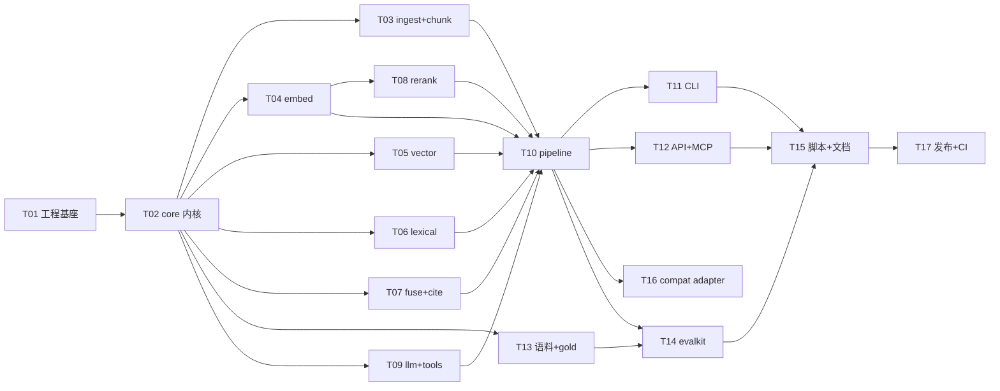

# TASKS — helios-ai-stack 实现任务分解

> 作者：晨星 ｜ 版本：v1.0 ｜ 配套文档：`docs/ARCHITECTURE.md`
> 通用纪律：单文件 ≤ 300 行；源码零 emoji；每个任务**必须可独立验证**（给出命令 + 判定依据）。
> **判据一律以计数为准**，不解析 pytest 文本输出、不依赖人眼（ARCH F-13）。

---

## 1. 任务总览

| ID | 任务名 | 所属模块 | 依赖 | 优先级 | 并行组 | 预估文件数 |
|---|---|---|---|---|---|---|
| T01 | 工程基座与 P0 门禁 | 根配置 + scripts | — | P0 | G0 | 14 |
| T02 | 内核层 core（契约/配置/Protocol/工具） | M01 | T01 | P0 | G1 | 21 |
| T03 | 数据层 ingest + chunk | M02 M03 | T02 | P0 | G2 | 18 |
| T04 | 嵌入层 embed（4 后端 + 降级） | M04 | T02 | P0 | G2 | 12 |
| T05 | 向量层 vector（numpy + faiss） | M05 | T02 | P0 | G2 | 10 |
| T06 | 词法层 lexical（BM25 + 中文 2-gram） | M06 | T02 | P0 | G2 | 10 |
| T07 | 组合层 fuse + cite | M07 M11 | T02 | P0 | G2 | 18 |
| T08 | 重排层 rerank（词法 + ONNX） | M08 | T02 T04 | P0 | G3 | 11 |
| T09 | 生成层 llm + 确定性 tools | M09 M10 | T02 | P0 | G3 | 16 |
| T10 | 编排层 pipeline（含工厂与降级） | M12 | T03 T04 T05 T06 T07 T08 T09 | P0 | G4 | 10 |
| T11 | CLI 装配 | M14 | T10 | P0 | G5 | 4 |
| T12 | HTTP/SSE API + MCP + 静态页 | M13 | T10 | P1 | G5 | 19 |
| T13 | 内置语料与 gold 集 | 数据 | T03 | P0 | G2 | 15 |
| T14 | 评测层 evalkit + 基线落盘 | M15 | T10 T13 | P0 | G5 | 13 |
| T15 | 一键脚本 + 基线产出 + 文档 | scripts/docs | T11 T12 T14 | P0 | G6 | 12 |
| T16 | LlamaIndex 兼容 adapter（可替换性证明） | M16 | T10 | P1 | G5 | 4 |
| T17 | GitHub 仓库发布与 CI 绿灯 | 交付 | T15 | P0 | G7 | 3 |

**任务总数：17**（P0 15 项 + P1 2 项）。

---

## 2. 并行组与关键路径



| 并行组 | 可同时开工 | 说明 |
|---|---|---|
| G0 | T01 | 基座，无依赖 |
| G1 | T02 | core 是唯一公共底座 |
| **G2（最大并行面）** | T03 / T04 / T05 / T06 / T07 / T13 | 六个任务彼此**仅依赖 T02**，可全并行 |
| G3 | T08 / T09 | T08 依赖 T04（复用模型加载），T09 独立 |
| G4 | T10 | 收敛点，依赖 G2+G3 全部 |
| **G5** | T11 / T12 / T14 / T16 | 均只依赖 T10（T14 另需 T13），可全并行 |
| G6 | T15 | 收敛点 |
| G7 | T17 | 发布 |

**关键路径（8 步）**：`T01 → T02 → T04 → T08 → T10 → T14 → T15 → T17`

---

## 3. 任务详情

### T01 — 工程基座与 P0 门禁

| 项 | 内容 |
|---|---|
| 所属模块 | 根配置 + scripts（L6） |
| 依赖 | 无 |
| 优先级 | P0 |
| 产出文件 | `pyproject.toml`、`requirements.txt`、`requirements.lock.txt`、`ruff.toml`、`pytest.ini`、`.gitignore`、`.env.example`、`.github/workflows/ci.yml`、`.github/workflows/release.yml`、`configs/default.yaml`、`configs/profile_offline.yaml`、`configs/profile_local.yaml`、`configs/profile_remote.yaml`、`scripts/scan_emoji.py` |
| 完成判据 | ① `pip install -r requirements.lock.txt --require-hashes` 退出码 0；② `pip check` 无冲突输出；③ `ruff check .` 0 error；④ `python scripts/scan_emoji.py` 退出码 0（扫 emoji + 单文件 ≤300 行）；⑤ 干净目录 `git clone` 后 `from helios import __version__` 可 import（验证 `.gitignore` 未误伤 `__init__.py`，ARCH F-19）；⑥ `pytest.ini` 中 `--basetemp=data/.pytest-tmp -p no:cacheprovider` 已固定 |

> 关键约束：`.gitignore` 临时文件规则**根锚定 `/_*`** 并追加 `!/**/__init__.py`（F-19）；`requirements.lock.txt` 由 `scripts/gen_lock.py`（T15）产出后回填。

---

### T02 — 内核层 core（契约 / 配置 / Protocol / 工具）

| 项 | 内容 |
|---|---|
| 所属模块 | M01 `core` |
| 依赖 | T01 |
| 优先级 | P0 |
| 产出文件 | `src/helios/__init__.py`、`core/__init__.py`、`core/codes.py`、`core/errors.py`、`core/config.py`、`core/protocols.py`、`core/types.py`、`core/hashing.py`、`core/text.py`、`core/net.py`、`core/trace.py`、`core/cache.py`、`core/registry.py`、`core/tests/test_{errors,codes,config,types,text,hashing,net,cache}.py`、`core/examples/minimal.py` |
| 完成判据 | ① `pytest src/helios/core/tests` 全绿且**用例数 ≥ 20**（计数断言）；② 错误码常量**唯一且全部匹配** `^E_[A-Z]+_[A-Z_]+$`；③ `test_text.py` 含 `Python 3.10` 不被误切的用例（F-10）；④ `test_net.py` 验证 `HELIOS_ALLOW_NETWORK=0` 时出网抛 `E_*_NET_DISABLED`，且 localhost client `trust_env is False`（F-11）；⑤ `python src/helios/core/examples/minimal.py` 退出码 0 |

---

### T03 — 数据层 ingest + chunk

| 项 | 内容 |
|---|---|
| 所属模块 | M02 `ingest`、M03 `chunk` |
| 依赖 | T02 |
| 优先级 | P0 |
| 产出文件 | `ingest/{__init__,base,text_parser,pdf_parser,service}.py`、`ingest/tests/test_{text_parser,pdf_parser,service,dedupe}.py`、`ingest/examples/minimal.py`、`chunk/{__init__,splitter,sizer,service}.py`、`chunk/tests/test_{splitter_heading,overlap,nonuniform}.py`、`chunk/examples/minimal.py` |
| 完成判据 | ① `pytest src/helios/ingest/tests src/helios/chunk/tests` 全绿，用例数 ≥ 14；② 同内容二次摄入 `chunks_added == 0`（幂等）；③ 标题行单独成块、其后正文继承 heading path；④ **`test_nonuniform.py` 语料按 `i % n` 变化长度且显式超阈值**，多分块路径被覆盖（F-7）；⑤ 全部 chunk 的 `span` 落在 `[0, len(doc.text))` 内 |

---

### T04 — 嵌入层 embed（4 后端 + 降级）

| 项 | 内容 |
|---|---|
| 所属模块 | M04 `embed` |
| 依赖 | T02 |
| 优先级 | P0 |
| 产出文件 | `embed/{__init__,base,hashing,fastembed_backend,onnx_direct,ollama_backend,service}.py`、`embed/tests/test_{hashing,service,normalize,ollama}.py`、`embed/examples/minimal.py` |
| 完成判据 | ① `pytest src/helios/embed/tests -m "not requires_model"` 全绿，用例数 ≥ 12；② `HashingEmbedder` 同输入两次输出**逐位相等**且 L2 范数 = 1.0±1e-6；③ 中文文本走**字符 bigram** 哈希；④ 换后端只改 `HELIOS_EMBED_BACKEND` 一个环境变量（ARCH §6），业务代码零改动；⑤ 后端不可用时 `diagnostics["_error"]` 被置位且按 `E_EMBED_DEGRADED` 降级（非严格模式不崩溃）；⑥ `test_ollama.py` 标 `requires_model`，未就绪则 skip（F-11/F-12） |

> 最大风险点（ARCH F-21）：**不得假设 fastembed 能下载成功**；local 档默认走本机 Ollama（bge-m3 / nomic-embed-text）。

---

### T05 — 向量层 vector（numpy + faiss）

| 项 | 内容 |
|---|---|
| 所属模块 | M05 `vector` |
| 依赖 | T02 |
| 优先级 | P0 |
| 产出文件 | `vector/{__init__,base,numpy_index,faiss_index,service}.py`、`vector/tests/test_{numpy,faiss,drop_document,persist}.py`、`vector/examples/minimal.py` |
| 完成判据 | ① `pytest src/helios/vector/tests` 全绿，用例数 ≥ 14；② `NumpyVectorIndex` 与 `FaissVectorIndex` 在随机数据上 top-k **集合一致**（顺序允许并列差异）；③ **`test_drop_document.py`**：先摄入长文档，再摄入同名更短文档，断言无孤儿分块（F-9）；④ persist → load 后检索结果不变；⑤ `E_VECTOR_DIM_MISMATCH` 在维度不符时抛出 |

---

### T06 — 词法层 lexical（BM25 + 中文 2-gram）

| 项 | 内容 |
|---|---|
| 所属模块 | M06 `lexical` |
| 依赖 | T02 |
| 优先级 | P0 |
| 产出文件 | `lexical/{__init__,tokenize,bm25,inverted,service}.py`、`lexical/tests/test_{tokenize,idf,service,persist}.py`、`lexical/examples/minimal.py` |
| 完成判据 | ① `pytest src/helios/lexical/tests` 全绿，用例数 ≥ 14；② **`test_idf.py`**：3 篇小语料下所有命中词得分 **> 0**（Robertson IDF `ln(1+(N-n+0.5)/(n+0.5))` 恒非负，F-1）；③ 中文按字符 2-gram、英文按词切分；④ 中文 query Recall@10 相对纯空格切分有提升（记录数值，P1-7 门限另定） |

---

### T07 — 组合层 fuse + cite

| 项 | 内容 |
|---|---|
| 所属模块 | M07 `fuse`、M11 `cite` |
| 依赖 | T02 |
| 优先级 | P0 |
| 产出文件 | `fuse/{__init__,rrf,weighted,service}.py`、`fuse/tests/test_{rrf,weighted,dedupe}.py`、`fuse/examples/minimal.py`、`cite/{__init__,markers,extract,align,service}.py`、`cite/tests/test_{markers,extract,align,roundtrip}.py`、`cite/examples/minimal.py` |
| 完成判据 | ① `pytest src/helios/fuse/tests src/helios/cite/tests` 全绿，用例数 ≥ 18；② 融合结果每条含 `dense_rank / sparse_rank / fused_score`（US3）；③ 跨路同 `chunk_id` 去重且分数合并正确；④ **`test_markers.py`**：`[id#n]` 与 `依据/来源/source:` 被完整剥离后再计入指标（F-5）；⑤ `test_roundtrip.py`：抽取 → 对齐 → 反查原文 span 命中率 = 100% |

---

### T08 — 重排层 rerank

| 项 | 内容 |
|---|---|
| 所属模块 | M08 `rerank` |
| 依赖 | T02、T04（复用模型加载与降级机制） |
| 优先级 | P0 |
| 产出文件 | `rerank/{__init__,base,lexical,onnx,noop,service}.py`、`rerank/tests/test_{lexical,noop,onnx,order}.py`、`rerank/examples/minimal.py` |
| 完成判据 | ① `pytest src/helios/rerank/tests -m "not requires_model"` 全绿，用例数 ≥ 14；② `LexicalReranker` 是**真实现**（IDF 加权），非空操作；③ 默认模型 `Xenova/ms-marco-MiniLM-L-6-v2`（≈0.08GB），`BAAI/bge-reranker-base` 由 `HELIOS_RERANK_MODEL` 开关切换；④ `test_order.py` 记录并断言 `rank_before → rank_after` 变化；⑤ `noop` 保证恒等序（供 B0 对照） |

---

### T09 — 生成层 llm + 确定性 tools

| 项 | 内容 |
|---|---|
| 所属模块 | M09 `llm`、M10 `tools` |
| 依赖 | T02 |
| 优先级 | P0 |
| 产出文件 | `llm/{__init__,base,template,llama_cpp_backend,ollama_backend,openai_backend,service}.py`、`llm/tests/test_{template,sentence_split,stream,service}.py`、`llm/examples/minimal.py`、`tools/{__init__,calculator}.py`、`tools/tests/test_calculator.py` |
| 完成判据 | ① `pytest src/helios/llm/tests src/helios/tools/tests -m "not requires_model"` 全绿，用例数 ≥ 18；② `TemplateLLM` 同输入输出**逐字符相等**（golden 断言）；③ **`test_sentence_split.py`**：`Python 3.10` 不被切分，正则 `(?<=[。！？])\|(?<=[.!?])(?=\s\|$)`（F-10）；④ `test_calculator.py`：全角 `０-９` 与全角运算符归一化正确；`ZeroDivisionError`/`OverflowError` 归一为 `E_TOOLS_*`；裁剪字符集**不含 `+ - * /`**（F-16）；⑤ `llama_cpp_backend` 线程数由 `HELIOS_LLM_THREADS` 控制（默认 4），**不重装依赖** |

---

### T10 — 编排层 pipeline（含工厂与降级）

| 项 | 内容 |
|---|---|
| 所属模块 | M12 `pipeline` |
| 依赖 | T03、T04、T05、T06、T07、T08、T09 |
| 优先级 | P0 |
| 产出文件 | `pipeline/{__init__,context,parse,rag,factory}.py`、`pipeline/tests/test_{render_roundtrip,query_offline,timings,factory}.py`、`pipeline/examples/minimal.py` |
| 完成判据 | ① `pytest src/helios/pipeline/tests` 全绿，用例数 ≥ 14；② **offline 全链路 1 条 E2E 必过**：输出 `Answer` 含 **≥ 1 条可回溯引用**（P0-5）；③ `timings` 含 embed/search/fuse/rerank/generate/cite/total 七个键；④ **`test_render_roundtrip.py`**：证据块每块压成一行，续行追加，渲染→解析往返一致（F-8）；⑤ `test_factory.py`：仅改 profile 配置即可切换全部后端，业务代码零改动；⑥ 结果**显式捕获**，禁止读 `last_*` 缓存字段（F-6） |

---

### T11 — CLI 装配

| 项 | 内容 |
|---|---|
| 所属模块 | M14 `cli` |
| 依赖 | T10 |
| 优先级 | P0 |
| 产出文件 | `cli/{__init__,main,__main__}.py`、`cli/tests/test_cli.py` |
| 完成判据 | ① `python -m helios.cli --help` 退出码 0；② 子命令齐备：`ingest / search / answer / eval / bench / serve / mcp / demo`；③ `python -m helios.cli demo --profile offline` 退出码 0；④ `pytest src/helios/cli/tests` 全绿（用例数 ≥ 6）；⑤ `main.py` 只装配零业务逻辑 |

---

### T12 — HTTP/SSE API + MCP + 静态页

| 项 | 内容 |
|---|---|
| 所属模块 | M13 `api` |
| 依赖 | T10 |
| 优先级 | P1（对应 PRD P1-2 / P1-3 / P1-8） |
| 产出文件 | `api/{__init__,schemas,deps,error_handler,app}.py`、`api/routes_{health,search,chat,ingest,metrics}.py`、`api/mcp_server.py`、`api/static/index.html`、`api/tests/test_{health,search,chat_sse,ingest,errors,mcp}.py`、`api/examples/minimal.py` |
| 完成判据 | ① `create_app()` 内部完成路由注册，`TestClient(app).get("/healthz").status_code == 200`（**全部路由非 404**，F-17）；② SSE 事件序列含 `token / citation / done`，错误态含 `error`；③ `/v1/search`、`/v1/ingest`、`/metrics` 均 200；④ 错误码 → HTTP 状态映射与 `ARCH §5` 表格**逐项一致**（用例覆盖 ≥ 10 个码）；⑤ MCP 暴露 `search` / `answer` 两个 tool 且可被 client 调用；⑥ 联合返回类型的路由装饰器加 `response_model=None`（F-17） |

---

### T13 — 内置语料与 gold 集

| 项 | 内容 |
|---|---|
| 所属模块 | 数据（L1） |
| 依赖 | T03（需与切块语义对齐） |
| 优先级 | P0 |
| 产出文件 | `data/corpus/*.txt`（≥ 12 篇，中英混合）、`data/gold.jsonl`（≥ 50 条 query-doc 对）、`data/gold_citation.jsonl`（20 条引用标注）、`data/.gitkeep` |
| 完成判据 | ① 语料篇数 ≥ 12，且段落长度**刻意非均匀**（按 `i % n` 变化）并存在显式超过分块阈值的文档（F-7）；② `gold.jsonl` 行数 ≥ 50，schema 校验 100% 通过；③ 每条 gold 至少含 1 个 `doc_id` 真值（**文档级真值为头条口径**，F-3）；④ `gold_citation.jsonl` 20 条含 `chunk_id + span + quote`；⑤ 语料零下载、作者可控 |

---

### T14 — 评测层 evalkit + 基线落盘

| 项 | 内容 |
|---|---|
| 所属模块 | M15 `evalkit` |
| 依赖 | T10、T13 |
| 优先级 | P0 |
| 产出文件 | `evalkit/{__init__,gold,metrics,runner,baselines,bench,report}.py`、`evalkit/tests/test_{metrics,doc_level,fresh_index,report,bench}.py`、`evalkit/examples/minimal.py` |
| 完成判据 | ① `pytest src/helios/evalkit/tests` 全绿，用例数 ≥ 20；② **每档评测新建独立索引**重新灌语料，不复用生产库（F-2）；③ 断言真实后端 `diagnostics["_error"] is None`，否则抛 `E_EVAL_FIXTURE_STALE`（F-2b）；④ **`test_metrics.py`**：任一输入为常量时秩相关返回 `0.0`（F-4）；⑤ `test_doc_level.py` 覆盖 `doc_hit_rate / doc_mrr`（F-3）；⑥ `python -m helios.cli eval` 产出 `benchmarks/baseline.json`，含 **B0/B1/B2/B3** 四组对照与 `recall@5/10 / mrr / ndcg@10 / doc_hit_rate / doc_mrr / p50 / p95`；⑦ `python -m helios.cli bench` 产出延迟与 `index_build_s` |

---

### T15 — 一键脚本 + 基线产出 + 文档

| 项 | 内容 |
|---|---|
| 所属模块 | scripts / docs（L6） |
| 依赖 | T11、T12、T14 |
| 优先级 | P0 |
| 产出文件 | `scripts/setup.ps1`、`scripts/demo.ps1`、`scripts/fetch_models.py`、`scripts/smoke.py`、`scripts/gen_lock.py`、`scripts/bench_threads.py`、`benchmarks/baseline.json`、`benchmarks/baseline.md`、`docs/DEPENDENCIES.md`、`docs/EVALUATION.md`、`README.md`、`CONTRIBUTING.md` |
| 完成判据 | ① `scripts/setup.ps1` 在干净目录**连续 3 次**退出码 0（P0-1）；② `scripts/demo.ps1` offline E2E 退出码 0（模型就绪时追加 local E2E）；③ `scripts/smoke.py` 全项 PASS，**以计数判定**不抓文本（F-13）；④ `scripts/scan_emoji.py` 全仓 0 命中（F-18）；⑤ `scripts/gen_lock.py` 产出带 sha256 的 `requirements.lock.txt`；⑥ `scripts/bench_threads.py` 扫 2/4/6/8/16 并输出最优线程数（默认 4）；⑦ `docs/DEPENDENCIES.md` 逐项列版本+许可证，**无 GPL/AGPL**；⑧ `README.md` 含架构/部署/使用/**基线表** |

---

### T16 — LlamaIndex 兼容 adapter（可替换性证明）

| 项 | 内容 |
|---|---|
| 所属模块 | M16 `compat` |
| 依赖 | T10 |
| 优先级 | P1（主理人拍板：必须交付，非 P0 验收链） |
| 产出文件 | `compat/{__init__,llamaindex_adapter}.py`、`compat/tests/test_llamaindex_adapter.py`、`compat/examples/minimal.py` |
| 完成判据 | ① 用 LlamaIndex 实现 `Embedder / VectorIndex / LexicalIndex / Reranker / LLM` 五个 Protocol 中的至少 3 个；② 在**同一 gold 集**上跑通并输出可与 B3 对比的指标；③ 缺 `llama-index-core` 时测试 **skip 而非 fail**，不进 P0 门禁；④ 业务代码（pipeline）零改动即可切换 |

---

### T17 — GitHub 仓库发布与 CI 绿灯

| 项 | 内容 |
|---|---|
| 所属模块 | 交付 |
| 依赖 | T15 |
| 优先级 | P0 |
| 产出文件 | `LICENSE`、`.github/workflows/ci.yml`（回填完整步骤）、仓库初始化与推送 |
| 完成判据 | ① 仓库 `CJX0712/helios-ai-stack` 可克隆；② LICENSE = Apache-2.0；③ 署名统一「晨星」（git author + 源文件内容）；④ GitHub Actions 在 `windows-latest × 3.13` 全绿：`pip install -r requirements.lock.txt --require-hashes` → `pip check` → `ruff check .` → `scripts/scan_emoji.py` → `pytest -m "not requires_model"` → `demo --profile offline`；⑤ CI 判定用退出码，不解析文本 |

---

## 4. 需求 → 任务映射（PRD P0/P1 全覆盖核对）

| PRD 需求 | 覆盖任务 |
|---|---|
| P0-1 一键脚本 | T15 |
| P0-2 依赖锁定 | T01、T15 |
| P0-3 离线可运行 | T02、T04、T05、T06、T08、T09、T10、T15 |
| P0-4 8+ 模块独立可测 | T02–T14 |
| P0-5 完整链路 | T10、T11 |
| P0-6 引用溯源 | T07、T13、T14 |
| P0-7 评测基线 | T13、T14、T15 |
| P0-8 接口契约与错误码 | T02、T10、T15 |
| P0-9 依赖锁定 + 许可证 | T01、T15 |
| P0-10 GitHub 仓库 + CI | T17 |
| P0-11 代码质量门禁 | T01、T15 |
| P1-1 local 真实模型链路 | T04、T08、T09、T15 |
| P1-2 FastAPI 服务 | T12 |
| P1-3 MCP server | T12 |
| P1-4 索引持久化与增量 | T05、T06 |
| P1-5 结果缓存 | T02（`core/cache.py`） |
| P1-6 可观测性 | T02（`core/trace.py`）、T10 |
| P1-7 中文分词优化 | T06 |
| P1-8 最小 Web 界面 | T12 |
| P2-1 远端 LLM adapter | T09（`openai_backend.py` / `ollama_backend.py`） |
| P2-2 LlamaIndex 兼容 adapter | **T16（主理人升级为 P1）** |
| P2-3 查询改写 | 不在本次范围（ARCH §12 U5 同类的 P2 项） |
| P2-5 Docker | 不进验收链（主理人拍板 Q5） |
| P2-6 BEIR 子集 | 不进 P0 验收链（主理人拍板 Q6） |

---

## 5. 每个任务的独立验证命令（速查）

```powershell
# 通用（务必带 basetemp，ARCH F-13）
$PY = "C:\Users\Administrator\.workbuddy\binaries\python\envs\helios\Scripts\python.exe"

# T01
& $PY -m pip install -r requirements.lock.txt --require-hashes; & $PY -m pip check
& $PY -m ruff check .; & $PY scripts/scan_emoji.py

# T02
& $PY -m pytest src/helios/core/tests --basetemp=data/.pytest-tmp -p no:cacheprovider

# T03
& $PY -m pytest src/helios/ingest/tests src/helios/chunk/tests --basetemp=data/.pytest-tmp -p no:cacheprovider

# T04 / T05 / T06 / T07
& $PY -m pytest src/helios/embed/tests src/helios/vector/tests src/helios/lexical/tests `
      src/helios/fuse/tests src/helios/cite/tests -m "not requires_model" `
      --basetemp=data/.pytest-tmp -p no:cacheprovider

# T08 / T09
& $PY -m pytest src/helios/rerank/tests src/helios/llm/tests src/helios/tools/tests `
      -m "not requires_model" --basetemp=data/.pytest-tmp -p no:cacheprovider

# T10
& $PY -m pytest src/helios/pipeline/tests --basetemp=data/.pytest-tmp -p no:cacheprovider
& $PY src/helios/pipeline/examples/minimal.py

# T11
& $PY -m helios.cli demo --profile offline

# T12
& $PY scripts/smoke.py

# T14
& $PY -m helios.cli eval  --profile offline
& $PY -m helios.cli bench --profile offline

# T15
.\scripts\setup.ps1; .\scripts\demo.ps1

# T16（缺依赖应 skip 而非 fail）
& $PY -m pytest src/helios/compat/tests -m "compat or not compat" `
      --basetemp=data/.pytest-tmp -p no:cacheprovider
```

> 判定原则：**退出码 + 用例计数 + 数值断言**，禁止依赖 pytest 的 stdout 文本或人眼观察（ARCH F-13）。

---

*文档结束 ｜ 作者：晨星*
